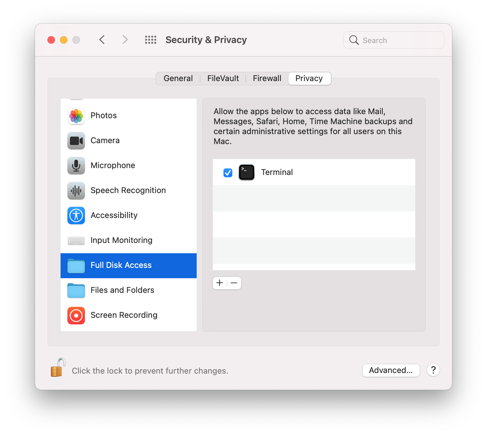

# FavTool
 

Sometimes, the homescreen of Safari looks ugly because of the inconsistent design of the favourite icons.
With Favtool you can easly costumize them by simply dropping your personal icons in your terminal.
In spite of being a command line tool, I tried to make the documentation clear and the experiece as user-friendly as possible.

  
  
  
  
  
  
  
  

# Getting started
 

Firstly, get the source.
You can download the zip file by pressing the green "code" button above, or you can run git clone.
Before running the script make sure your terminal have full access to the disk.
To do it, go to:

  
  

 *> System Preferences> Security and privacy> Privacy> Full disk access > check the terminal bar* 

⚠️ IMPORTANT: if "terminal" is not shown, momentarely skip this step, run the script once (it will fail) and check again for it.
If you are reciving the "rm/cp: permission denied" error, double check this step.

  
  
  
  

# Features
 

Favtool has everyting you need to customize  or manage Safari's icons. You can choose one of the four functions by typing the corrispondent number (1 to 4) and press return. If you are running Safari Technology preview
Open a terminal, write bash and drop the FavToolSTP.sh file inside the main folder, then follow the script instructions.

### 1- Change an icon 

The first option allows you to change one of the icons of your favorite sites in Safari's Home. Once 1 is selecteded, drag and drop one of your favourite sites to which you want to replace the icon from the home of Safari directly to your terminal and press return. 

Then the script will ask you to drop the icon you have chosen, you can drop it in FavTool's window and press return (please take a look at the "icon rules" section below). Now by pressing any key, Safary will be restarted. If you want to manually close Safari later, press ctrl+c to stop FavTool. As soon as it will be reopened, the new icon will show up. Press any key to continue.

### 2 - Unlock image folder 

Once FavTool is run, it locks the folder located in  ~/Library/Safari/Touch\ Icons\ Cache/Images. This prevents Safari from automatically restore the default icons. Choose this option if you want to unlock this folder. However, make sure to keep Safari closed as long as the folder is unlock, otherwise this may lead to issues.

### 3 - Restore default icons 

This option allows you to delete any change you've done on icons. By running this, the whole Touch Icons Chache folder will be deleted, and recreated as soon as Safari is opened. Safary will reload all the icons from scratch. This option might fix missing icons

  

# Icon rules

You can download icons for free in many sites, these are the one I often use:

* https://icons8.com, here you can find a very big library with many styles;
* https://macosicons.com, here you can find many styles but more app/programm-oriented;
* https://www.macosicongallery.com, Here you can find original Mac icons.

Icons has to be .png files, about 144x144p (Safari seems to be quite flexible, however, make sure to not overshoot 256x256p) and most importantly the **ICONS NAME CANNOT CONTAIN SPACES OR ANY OTHER SPECIAL CHARACTER**, they can be transparent.

PS: you can even make them by yourself!
Take a look at the Apple User Interface Guidelines https://developer.apple.com/design/human-interface-guidelines/macos/icons-and-images/app-icon/ 

