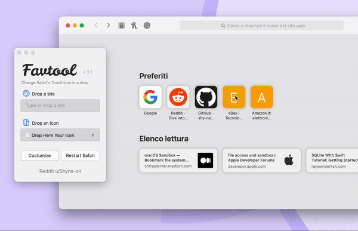
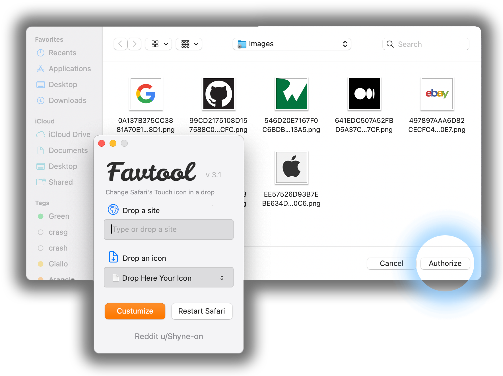

# FavTool

Sometimes, the homescreen of Safari looks ugly because of the inconsistent design of the favourite icons.
With Favtool you can easly costumize them by simply dropping your personal icons.

## Getting Started

The First time Favtool is opened, a window will pop up, select _"Authorize"_. This will allow favtool to read/write the folder in which the icons are located.

If the message _"Operation not permitted"_ is shown, maybe favtool could not access the images folder. Go to _Advanced_ > _Allow Image folder access_ (or use the keyboard shortcut <kbd>alt</kbd><kbd>cmd</kbd><kbd>a</kbd>), then select _"Authorize"_.

## How to run

Get the source and double clik on the `.dmg` file. Here you will find the application itself.

⚠️ Whenever FavTool is run for the first time, the message _**"Apple can’t check app for malicious software"**_ might be shown. In order to run favtool <kbd>ctrl</kbd><kbd>click</kbd> the app and select _"Open"_.

# Features

### Change an icon

To change an icon, drag and drop one of your favourites that you want to replace the icon for from the Safari home page:

Then, you can drop the icon you have chosen (please take a look at the _"Icon rules"_ section below). Now by pressing the orange _"Customize"_ button, the icon will be changed. If you want to manually close Safari later, press <kbd>ctrl</kbd><kbd>c</kbd> to stop FavTool. As soon as Safari reopens, the new icon will show up.

### Unlock image folder

Once FavTool is run, it locks the folder located in: `~/Library/Safari/Touch Icons Cache/Images`

This prevents Safari from automatically restore the default icons. If you want to unlock this folder click on _"Action"_ in the menu bar and then _"Unlock Images Folder"_ (or use the <kbd>⌥</kbd><kbd>⌘</kbd><kbd>U</kbd> shortcut. However, make sure to keep Safari closed as long as the folder is unlocked, otherwise this may lead to issues.

### Restore default icons

This option allows you to delete any change you've done on icons. To do this, go to _Actions_ > _Dismiss changes_ or use the keyboard shortcut <kbd>⌥</kbd><kbd>⌘</kbd><kbd>D</kbd> . The whole `Touch Icons Cache` folder will be deleted, and recreated as soon as Safari is opened. Safari will reload all the icons from scratch. This option _might_ fix missing icons.

# Icon rules

You can download icons for free in many sites, these are the one I often use:

- <https://icons8.com> - A very big library with many styles
- <https://macosicons.com> - Many styles with more of an app /programme focus
- <https://www.macosicongallery.com> - Original Mac icons

Icons has to be `.png` files, about `144`x`144p` (Safari seems to be quite flexible, however, make sure to not overshoot `256`x`256p`), they can be transparent.

You can even make them by yourself! Get started by taking a look at the [Apple User Interface Guidelines](https://developer.apple.com/design/human-interface-guidelines/macos/icons-and-images/app-icon/).
